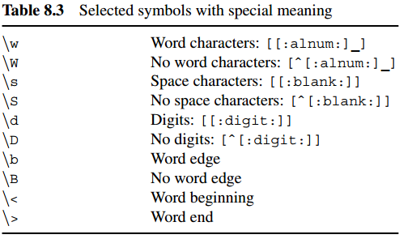

```{r setup, include=FALSE}
knitr::opts_chunk$set(echo = TRUE)
```

# 基于R的自动数据收集

## 1.概述

### 推荐资料

1. 绝对的新手<http://tryr.codeschool.com>
2. 基本命令的检索<http://www.statmethods.net/>
3. 免费的资源和例子<http://www.ats.ucla.edu/stat/r/>

### 案例研究

安装以下包
* "stringr", "XML", "maps"

## 2.HTML
读取
```{r eval = FALSE}
rm(list=ls())
url <- "http://www.r-datacollection.com/materials/html/fortunes.html"
fort <- readLines(con = url)
fort
```

利用XML包解析并保存。XML提供了一个和libxml2库的借口，可以应付很多问题，比如处理形态不良的网页，可以纠正错误。
```{r eval = FALSE}
rm(list=ls())
library(XML)
url <- "http://www.r-datacollection.com/materials/html/fortunes.html"
fort <- htmlParse(file = url)
print(fort)

```

对于不需要的节点，可以在解析过程中删除
```{r warning=FALSE,eval = FALSE}
url <- "http://www.r-datacollection.com/materials/html/fortunes.html"
h1 <- list("body" = function(x){NULL})
parse_fort <- htmlTreeParse(url, handlers = h1, asTree = TRUE)
parse_fort$children 
```
对于特定的节点进行删除工作
```{r warning=FALSE,eval = FALSE}
url <- "http://www.r-datacollection.com/materials/html/fortunes.html"
h2 <- list(
        startElement = function(node,...){
          name <- xmlName(node)
          if(name %in% c("div","title")){NULL}else{node}
        },
        comment = function(node){NULL}
)
parse_fort <- htmlTreeParse(url, handlers = h2, asTree = TRUE)
parse_fort$children 
```

## 3.XML与JSON

### xml有很强的自描述能力，标签与内容的一起出现
 
1. XML区分大小写
2. 元素名称不能包含空格
3. 注释为“<!-- ****** -->”
4. 阻止内容被转译<![CDATA[******]]>

### JSON
轻量级
处理JSON的包有很多
1.  rjson 第一个发布的包
2.  RJSONIO更加完善的包
3.  jsonlite ，在RJSONIO的基础上构建，改善了R对象与JSON字符串的映射，视为标准工具

## 4.XPath

通过使用XML Path语言（简称XPath）里简洁强大的path语句，访问HTML/XML文档中的特定信息是非常简单的。


```{r warning=FALSE,eval=FALSE}
rm(list=ls())
library(XML)
parsed_doc <- htmlParse(file = "http://www.r-datacollection.com/materials/html/fortunes.html")
print(parsed_doc)
```

### 1. XPath是查询语言，
用于HTML/XML文档的定位和提取片段,调用XML中的xpathSApply函数，如下
```{r eval=FALSE}
xpathSApply(doc = parsed_doc, path = "/html/body/div/p/i")
```
以上路径为绝对路径。
相对路径如下
```{r eval=FALSE}
xpathSApply(doc = parsed_doc, path = "//body//p/i")
```
更简洁的相对路径如下
```{r eval=FALSE}
xpathSApply(doc = parsed_doc,path = "//p/i")
```
比较：
相对路径简短，但是需要对文档进行完全遍历，降低查询效率，对于小文件没有问题，对于较大的文件会很慢，此时，大文件或者多个文档进行提取操作时，需要绝对路径

除了以上路径问题，XPath还允许特殊含义的符号。*作为通配符，可以匹配对应位置的任意名字的节点。如下，可匹配p
```{r eval=FALSE}
xpathSApply(doc = parsed_doc,path = "/html/body/div/*/i")
```
..操作符可以选择当前节点的上一级节点，如我们希望选择head节点，可以选择子节点title,然后向上一层。如下，
```{r eval=FALSE}
xpathSApply(doc = parsed_doc,path = "//title/..")
```
若需要一次进行多个查询，提取位于不同路径的元素，有如下两种方法：

1. 使用|
```{r eval=FALSE}
xpathSApply(doc = parsed_doc,path = "/html/body/div/*/i | //title")
```
2. 使用向量
```{r eval=FALSE}
goals <- c(i = "/html/body/div/*/i", title = "//title")
xpathSApply(doc = parsed_doc, goals)
```

### 2. 节点关系

从一个特定的点中提取信息，如选择具有a节点的div节点，使用特征如下 node1/relation::node2。
```{r eval=FALSE}
xpathSApply(doc = parsed_doc, "//a/ancestor::div")
```
进一步拓展，如下
```{r eval=FALSE}
xpathSApply(doc = parsed_doc, "//a/ancestor::div//i")
```
更复杂的表达如下,选取所有的p节点之前的h1兄弟节点
```{r eval=FALSE}
xpathSApply(doc = parsed_doc, "//p/preceding-sibling::h1")
```

```{r eval=FALSE}
xpathSApply(doc = parsed_doc, "//p/child::*")
```


更多的表示如图


### 3. XPath谓语

#### 1. 数字谓语

##### 位置
```{r eval=FALSE}
xpathSApply(doc = parsed_doc, "//p[position()=1]")
```

position ,选择出现在第一个位置的p节点。选择的是相对于父节点的节点子集中那个是第一个。
若想知道最后一个节点，可用last（）
```{r eval=FALSE}
xpathSApply(doc = parsed_doc, "//p[last()]")
```
选择倒数第二个，为last()-1
```{r eval=FALSE}
xpathSApply(doc = parsed_doc, "//p[last()-1]")
```
##### 计数

选择符合计数条件的节点集作为结果。如下，选择节点内至少有一个a节点的div节点作为数据集。
```{r eval=FALSE}
xpathSApply(doc = parsed_doc, "//div[count(.//a)>0]")
```
如下，选择节点内各种属性(即div的属性)总和大于2的div节点。
```{r eval=FALSE}
xpathSApply(doc = parsed_doc, "//div[count(./@*)>2]")
```
获取某个元素内的字符数。如下，获取包含大量字符的节点。
```{r eval=FALSE}
xpathSApply(doc = parsed_doc, "//*[string-length(text())>50]")
```
反选，如下，选择所有不多余2个属性的div节点。
```{r eval=FALSE}
xpathSApply(doc = parsed_doc, "//div[not(count(./@*)>2)]")
```

#### 2. 文本谓语

选取div节点中date属性为October/2011,如下
```{r eval=FALSE}
xpathSApply(doc = parsed_doc, "//div[@date='October/2011']")
```
=是一种比较严格匹配形式，可以用如下更轻松的方式匹配。string_method(text1,'text2')
如下，选取文本中包含个magic的节点

```{r eval=FALSE}
xpathSApply(doc = parsed_doc, "//*[contains(text(), 'magic')]")
```
如下，选择所有具有id属性并且以字符R开头的div节点
```{r eval=FALSE}
xpathSApply(doc = parsed_doc, "//div[starts-with(./@id, 'R')]")
```
仔细分析以下语句
```{r eval=FALSE}
xpathSApply(doc = parsed_doc, "//div[substring-after(./@date, '/')='2003']")
```

### 4.提取节点元素

提取title的值
```{r eval=FALSE}
xpathSApply(doc = parsed_doc, "//title", fun = xmlValue)
```
得到所有div的属性名称
```{r eval=FALSE}
xpathSApply(doc = parsed_doc, "//div", fun = xmlAttrs)
```

更多提取函数如下


扩展fun参数
```{r eval=FALSE}
lowerCaseFun <- function(x){
  x <- tolower(xmlValue(x))
  x
}
xpathSApply(parsed_doc, "//div//i", fun = lowerCaseFun)

```


## 5.HTTP

### 5.1 HTTP基础

1. 互联网协议族(Internet Protocol Suite,IPS),重要的两个协议TCP(Transmission Control Protocol传输控制协议),IP(Internet Protocol互联网协议).分别代表了TCP(传输层)和IP(因特网层)，负责计算机之间的可靠数据传输。
2. 在以上的传输标准之上，有专用的信息交换协议。如HTTP (Hyper Text Transfer Protocol), FTP (File Transfer Protocol), Post Offce Protocol(POP) for email retrieval, SMTP (Simple Mail Transfer Protocol) or IMAP (Internet Message Access Protocol) for email storage and retrieval. 
3. HTTP不仅是获取超文本文档的标准，也足够灵活，能够从服务器请求几乎任何类型资源，而且可以发送数据。
4. 交互如下图表示
5. URL(Uniform Resource Locators统一资源定位符),URL会对字符进行转译，通过R的基础函数URLencode(),URLdecode()可以编码和解码URL中的字符。
```{r results='hold',eval=FALSE}
a <- "I'm good person and I'm boy&1+1=2"
url <- URLencode(a, reserved = TRUE)
url
URLdecode(url)
```
6. HTTP消息，请求与响应，都由三部分组成，起始行(start line)标头(headers)正文(body)。
7. 状态码，404，服务器无法找到响应网页。状态码从100到599。1xx表示信息,2xx表示成功,3xx表示重定向,4xx表示客户端错误,5xx表示服务器错误。

### 5.2 HTTP高级特性
扩展HTTP功能的三个领域
1. 身份识别问题
2. 不同身份的验证，有助于使服务器-客户端的数据交换更安全
3. 特定类型的网络中介，即客户端与服务器的中间人，代理服务器

RCurl包提供了把R当做Web客户端软件的手段。

#### 5.2.1 身份识别
客户端与服务器之间通过HTTP进行的是无记忆的机制。
```{r results='hold',eval=FALSE}
R.version$version.string
R.version$platform
```
配置GET请求。
```{r results='hold',warning=FALSE,eval=FALSE}
library(RCurl)
cat(getURL("http://httpbin.org/headers",
                useragent = paste(R.version$platform,R.version$version.string,sep = ","
                              )))
cat(getURL("http://httpbin.org/headers", referer = "http://www.r-datacollection.com/"))
cat(getURL("http://httpbin.org/headers", httpheader = c(From = "eddie@r-collection.com")))

cat(getURL("http://httpbin.org/headers", cookie = "id=12345;domain=httpbin.org"))


```
cat用于串接并输出多行结果

#### 5.2.2 身份验证

### 5.3 其他协议
### 5.4 HTTP实战
1. 两个包，强大的RCurl包与轻量级更方便的httr包，httr包也是基于RCurl包的。
2. R的基础框架中有用于下载网络资源的基本功能。download.file()可以处理很多下载程序，无需对HTTP请求作复杂的修改。不过对于复杂的任务，使用RCurl和httr包。

#### 5.4.1 libcurl
使用libcurl库可以处理如下任务：
1. 声明HTTP标头
2. 解析URL编码
3. 处理来自web服务器的输入数据流
4. 建立SSL连接
5. 连接代理
6. 处理身份验证
libcurl用c语言编写，速度更快，处理如填写表单，身份验证或建立状态对话等任务更优秀。

#### 5.4.2 基本请求方法
##### 1. GET方法

1. getURL() 基本函数，默认情况下使用。
2. getBinaryURL() 便于处理二进制内容。
3. getURLContent() 尝试通过检查响应标头的Content-type字段确定内容类型，进行相应处理，配置会更复杂。

getURL()会自动确定主机，端口和请求资源，如果调用成功，服务器返回2XX代码以及正文，函数就会返回相应的内容，这种正常的情况下，R/libcurl与服务器的协商对我们而言是隐藏的。
```{r eval=FALSE,warning=FALSE}
library(RCurl)
getURL("http://www.r-datacollection.com/materials/http/helloworld.html")
```
如果请求的是二进制内容，则使用getBinaryURL()获取原始内容，如下获取png图片,并用基础函数存储在本地。

```{r eval=FALSE}
pngfile <- getBinaryURL("http://www.r-datacollection.com/materials/http/sky.png")
writeBin(pngfile,"sky.png")
```
对于需要输入表单进行返回的内容，可以如下:
```{r eval=FALSE}
url <- "http://www.r-datacollection.com/materials/http/GETexample.php"
namepar <- "apple"
agepar <-"20"
url_get <- paste(url, "?", "name=", namepar, "&", "age=", agepar, sep ="" )
cat(getURL(url_get))
```
另一种简单的方法，getForm()
```{r eval=FALSE}
url <- "http://www.r-datacollection.com/materials/http/GETexample.php"

cat(getForm(url, name = "apple", age = "21"))
```

##### 2. POST方法
与GET方法相比，POST方法能支持更加复杂的请求，因为这种情况下，请求参数不需要插入到URL中，URL的长度受到web浏览器的限制。使用postForm()函数，如下
```{r eval=FALSE}
url <- "http://www.r-datacollection.com/materials/http/POSTexample.php"

cat(postForm(url, name = "apple", age = "21", style = "post"))
```
#### 5.4.3 RCurl底层函数
RCurl是构建在libcurl库的基础上的。
curlPerform()是主要函数，负责收集执行web请求方式的选项：使用哪个协议或方法，设置哪个标头字段等，整理好后交给libcurl去执行。
```{r eval=FALSE}
url <- "www.r-datacollection.com/materials/http/helloworld.html"

pres <- curlPerform(url = url)
```

```{r eval=FALSE}
rm(list=ls())
pres <- NULL
url <- "www.r-datacollection.com/materials/http/helloworld.html"
performOptions <- curlOptions(url = url, writefunc = function(con) pres <<- con)
curlPerform(.opts = performOptions)

pres 
```

```{r eval=FALSE}
rm(list=ls())
content <- basicTextGatherer()
header <- basicTextGatherer()
debug <- debugGatherer()


url <- "www.r-datacollection.com/materials/http/helloworld.html"
performOptions <- curlOptions(url = url,
                              writefunc = content$update,
                              headerfunc = header$update,
                              debugfunc = debug$update,
                              verbose = T)
curlPerform(.opts = performOptions)

 
```

使用内容的value()函数，可以提取从服务器发送的内容。
```{r eval=FALSE}
cat(content$value())
```

header$value()包含从服务器返回的标头
```{r eval = FALSE}
cat(header$value())
```

debug$value()包含HTTP请求的多份信息。
```{r eval = FALSE}
cat(debug$value())
names(debug$value())
debug$value()["headerIn"]
```

#### 5.4.4 在多个请求中保持连接

在HTTP/1.0版中，默认每个请求创建一个连接，这种做法速度慢而且效率低。在HTTP/1.1版本中，默认的连接是持久的，这意味着我们可以给多个请求使用同一个连接。在RCurl中提供了重复使用已有连接的功能，可以利用它来创建更快地抓取程序。
创建如下处理器：
```{r eval = FALSE}
handle <- getCurlHandle()
```
以上只是一个空的容器，可以加入一些curl选项
```{r eval = FALSE}
handle <- getCurlHandle(useragent = paste(R.version$platform,
                                          R.version$version.string,
                                          sep = ","),
                        httpheader = c(from = "ed@datacollection.com"),
                        followlocation = TRUE,
                        cookiefile = "")

lapply(url, getURL, curl = handle)
```

保留原有处理器的状态对另一个请求使用修改的处理器，可以用以下方式克隆
```{r eval = FALSE}
handle2 <- dupCurlHandle(curl = handle, httpheader = c(from = "max@datacollection.com"))
```

#### 5.4.5 选项
RCurl函数的调用中声明选项，常用的选项如下


设置header为TRUE，显示标头

```{r eval = FALSE}
res <- getURL(url =url, header = TRUE)
cat(res)
```


#### 5.4.5 调试

通过在函数调用中声明一个调试信息采集器。
1. 通过调用debugGatherer()创建一个包含三个函数(update(),value(),reset())的对象.
```{r eval = FALSE}
debugInfo <- debugGatherer()
names(debugInfo)
class(debugInfo[[1]])
```

2. 请求一个网页。
```{r eval = FALSE}
url <- "www.r-datacollection.com/materials/http/helloworld.html"
res <- getURL(url =url, debugfunction = debugInfo$update,verbose = T)
```
3. 访问收集的调试信息。
```{r eval = F}
names(debugInfo$value())
```
text获取了 libcurl提供的关于该程序的信息：

```{r eval = F}
cat(debugInfo$value()["text"])
```
headerIn 存放了HTTP响应的标头
headerOut 存放了HTTP请求的标头
dataIn 存放了响应的正文

#### 5.4.7 错误处理
使用tryCatch来捕捉错误。
```{r eval = F}
url1 <- "wwww.r-datacollection.com/materials/http/helloworld.html"
url2 <- "www.r-datacollection.com/materials/http/helloworld.html"
res <- tryCatch(
  getURL(url = url1),
  COULDNT_RESOLVE_HOST = function(error){
    getURL(url = url2)
  },
  error = function(error){
    print(error$message)
    NA
  }
)
cat(res)
```

## 6.AJAX

利用chrome的检查，获取到数据的具体路径，使用R进行收集，进一步分析。

## 7.SQL和关系型数据库
利用RSQLite包和RODBC在R中连接sql数据库。
## 8.正则表达式和基本字符串函数
利用stringr包，有大部分字符处理能力。
### 8.1正则表达式
正则表达式是用于搜索和操作文本数据的概括性文本特征，是对字符查询的惯例。以下例子贯穿本节
```{r eval = FALSE,warning = F}
library(stringr)
example.obj <- "1. A small sentence. - 2. Another tiny sentence."
```
#### 8.1.1 严格的字符匹配
最基础的层次是字符与字符的匹配。如下
```{r eval = F, results='hold'}
str_extract(example.obj, "small")
str_extract(example.obj, "apple")
str_extract_all(example.obj, "sentence")
```

str_extract_all 可以对多个字符串进行调用，如下
```{r eval = F, results='hold'}
str_extract_all(c("text", "body", "hello"), "o")
```

默认情况下，字符匹配是区分大小写的，正则表达式中，大写与小写字母是不同的。
可以用ignore.case()改变效果。
```{r eval = F, results='hold'}
str_extract(example.obj, "small")
str_extract(example.obj, "Small")
str_extract(example.obj, ignore.case("Small"))
str_extract(example.obj, fixed("Small", ignore_case = T))

```

正则表达式的起始位置^表明是起始点，结尾的$表明是结尾处,|表示或者。
```{r eval = F, results='hold'}
str_extract(example.obj, "^2")
str_extract(example.obj, "2")

str_extract_all(example.obj, "sentence.$")
str_extract_all(example.obj, "sentence.")

str_extract_all(example.obj, "tiny|sen")
```

#### 8.1.2 正则表达式的广义化
"."可以匹配任何字符
```{r eval = F, results='hold'}
str_extract(example.obj, "sm.ll")
```
字符类。
"[]" 括号内的任意字符都会匹配,"-"另一种方法
```{r eval = F, results='hold'}
str_extract(example.obj, "sm[abc]ll")
str_extract(example.obj, "sm[a-p]ll")

```
在字符类中，"."无任何特殊含义。


提取标点符号,扩展预定义，反转预定义
```{r eval = F, results='hold'}
str_extract_all(example.obj, "[[:punct:]]")
str_extract_all(example.obj, "[[:punct:]ABC]")
str_extract_all(example.obj, "[^[:punct:]ABC]")


```
量化符{},?,*,+,如下


```{r eval = F, results='hold'}
str_extract(example.obj, "s[[:alpha:]][[:alpha:]][[:alpha:]]l")
str_extract(example.obj, "s[[:alpha:]]{3}l")
str_extract(example.obj, "A.+sentence")
str_extract(example.obj, "A.+?sentence")


str_extract_all(example.obj, "(.en){1,5}")
str_extract_all(example.obj, ".en{1,5}")


str_extract_all(example.obj, ".")
str_extract_all(example.obj, "\\.")
str_extract_all(example.obj, "[.]")


```

?之前的条目是可选的，最多匹配一次
\\反斜杠，特殊含义的字符原始含义。
特殊含义的字符




\w可以匹配任何单词字符,\w相当于[[:alnum:]]
\1可以表示未知的字符
```{r eval = F, results='hold'}
str_extract_all(example.obj, "\\w+")

str_extract_all(example.obj, "([[:alpha:]]).+?\\1")

str_extract_all(example.obj, "(\\b[b-z]+\\b).+?\\1")


```

### 8.2

#### 8.2.1 stringr包
str_locate()和str_locate_all()可以返回位置。
str_sub()提取相应字符，也可以进行替换


```{r eval = F}
str_locate_all(example.obj, "tiny")
str_sub(example.obj, start = 35, end = 38)
str_sub(example.obj, start = 35, end = 38) <- "huge"
example.obj
```

更通用的替换方法，str_replace() 和str_replace_all().
分拆，str_split()
分拆为固定的几块，str_split_fixed()

```{r eval = F}
str_replace(example.obj, pattern = "huge", replacement = "giant")
example.obj
unlist(str_split(example.obj, "-"))
unlist(str_split(example.obj, "[[:blank:]]", 5))
```

特定元素是否在序列中出现str_detect()
出现的频率str_count()
复制字符串str_dup()
字符串长度计数str_length()
在字符串边界添加字符，删去空格str_pad()和str_trim().
拼接str_c()
```{r eval = F, results='hold'}
char.vec <- c("this", "and this", "and that")

str_detect(char.vec, "this")

str_count(char.vec, "this")
str_count(char.vec, "\\w+")

dup.vec <- str_dup(char.vec, 3)
dup.vec

str_length(char.vec)

char.vec <- str_pad(char.vec, width = max(str_length(char.vec)), side = "both", pad = " ")
char.vec

char.vec <- str_trim(char.vec)
char.vec

cat(str_c(char.vec, collapse = "\n"))
str_c("text", c("A", "B"), sep = " ")
```
#### 8.2.2 其他实用函数
agrep(),进行匹配
pmatch(),第一个向量的字符串在第二个向量中出现的位置
make.unique()，把不唯一的字符串化为唯一的

```{r eval=FALSE, results='hold'}
agrep("abc efg", "acb eefg", max.distance = list(all = 3))
agrep("abc efgee", "ABCDEFD efgee", max.distance = list(all = 1))

char.vec
pmatch(c("this", "and that", "and", "those" ), char.vec)

make.unique(c("a", "b", "c", "c", "c", "c"))
```


### 8.3 字符编码简介

在tau包中，有函数检验是何种编码。

```{r eval=FALSE,warning=FALSE}
library(tau)
vac <- "abcdes"
is.utf8(vac)
is.ascii(vac)
```


## 9. 网络抓取
### 9.1 数据检索的场景

默认加载以下包。
```{r eval=FALSE,warning=FALSE}
library(RCurl)
library(XML)
library(stringr)
```

#### 9.1.1 下载现成文件

```{r eval=FALSE,warning=FALSE}
url <- "http://www.elections.state.md.us/elections/2012/election_data/index.html"
## getHTMLLink获取url中的所有URL和外部文件名
links <- getHTMLLinks(url)
filenames <- links[str_detect(links,"_General.csv")]

filenames_list <-as.list(filenames)
filenames_list[1:3]
```


